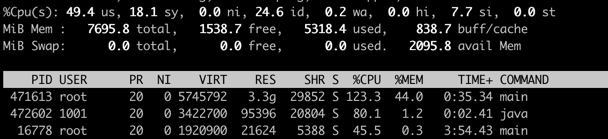
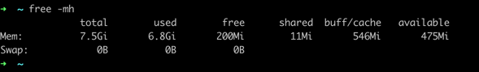

# 性能测试

## 背景说明

### 机器选择
服务端：4核8g 实际能使用的内存在6g 第三方依赖 占了2g

客户端：4核8g


### 启动说明
服务端相关内容启动
1. 切换工作目录 demo/ws
2. 启动第三方依赖 make e2e_up
3. 启动mock后端服务  make mock_backend
4. 启动ws网关 make run_gateway_only


客户端相关内容准备
1. 工作目录还是 demo/ws
2. 运行客户端压测脚本 go run client/example/main.go 
3. 相关参数可以查看 demo/ws/client/example/usage.md


## 测试目的
了解websocket服务器的如下指标
1. 最大并发连接数
2. 单位时间消息吞吐量（TPS）在这个项目里，事务里就是客户端发一条数据 ws返回ack，然后客户端返回ack。
3. 系统资源占用（CPU、内存、IO）


## 压测时的变量
1. github.com/gobwas/ws包的一些参数
2. 系统的tcp相关参数
3. 系统的websocket相关参数
4. 并发连接数
5. 消息大小
6. 消息频率

## 第一次

### 修改并发连接数 每秒一条数据，一条数据100B 
1. 少量并发100，测试一下
```shell
go run main.go -clients=100 -mps=1 -duration=40s
2025/06/27 13:57:55 === 统计信息 ===
2025/06/27 13:57:55 总连接数: 100
2025/06/27 13:57:55 总消息数: 3900
2025/06/27 13:57:55 成功消息数: 3900
2025/06/27 13:57:55 失败消息数: 0
2025/06/27 13:57:55 运行时间: 40.002450155s
2025/06/27 13:57:55 消息速率: 97.49 msg/s
2025/06/27 13:57:55 成功率: 100.00%
```


2. 并发数2500正常执行，内存基本上已经用完
```shell

go run main.go -clients=2500 -mps=1 -duration=40s
2025/06/27 14:32:37 === 统计信息 ===
2025/06/27 14:32:37 总连接数: 2500
2025/06/27 14:32:37 总消息数: 74552
2025/06/27 14:32:37 成功消息数: 74552
2025/06/27 14:32:37 失败消息数: 0
2025/06/27 14:32:37 运行时间: 30.853825357s
2025/06/27 14:32:37 消息速率: 2416.30 msg/s
2025/06/27 14:32:37 成功率: 100.00%
2025/06/27 14:32:37 ================
```
内存监控

cpu监控


3. 并发数3000 到达极限，开始出现发送消息超时的现象
```shell
go run main.go -clients=3000  -mps=1 -duration=40s

2025/06/27 14:07:24 === 统计信息 ===
2025/06/27 14:07:24 总连接数: 3000
2025/06/27 14:07:24 总消息数: 116688
2025/06/27 14:07:24 成功消息数: 116414
2025/06/27 14:07:24 运行时间: 40.100594292s
2025/06/27 14:07:24 消息速率: 2909.88 msg/s
2025/06/27 14:07:24 成功率: 99.77%
2025/06/27 14:07:24 ================
```



## 第二次

### 在接近极限的2500的时候，修改消息速度改成一秒两个
1. 一秒两个
```shell
有很多超时的请求
2025/06/27 14:50:09 === 统计信息 ===
2025/06/27 14:50:09 总连接数: 2500
2025/06/27 14:50:09 总消息数: 164295
2025/06/27 14:50:09 成功消息数: 148601
2025/06/27 14:50:09 失败消息数: 15694
2025/06/27 14:50:09 运行时间: 40.253081311s
2025/06/27 14:50:09 消息速率: 4081.55 msg/s
2025/06/27 14:50:09 成功率: 90.45%
2025/06/27 14:50:09 ================
```


